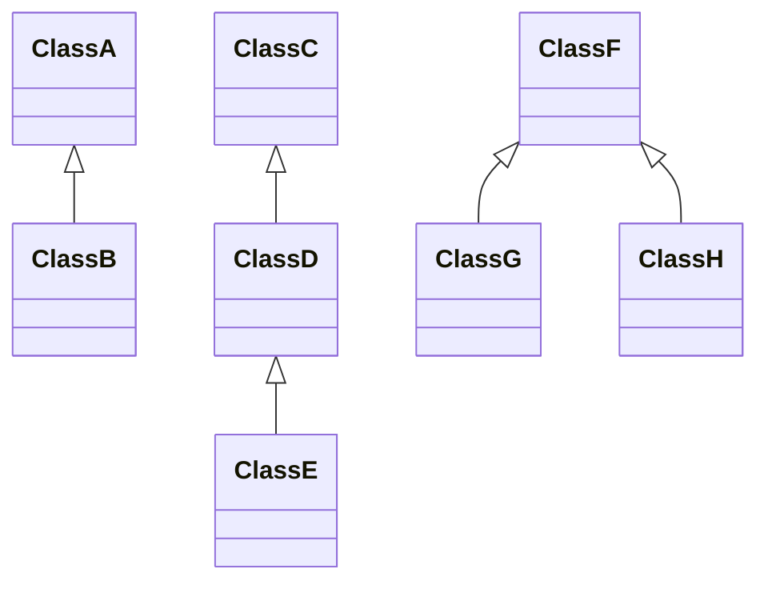

# Wykład 2
### *Klasy, modyfikatory dostępu, pakiety*
### *Zmienne i metody statyczne*
### *Klasy abstrakcyjne, dziedziczenie*
### *Interfejsy, rekordy*
### *Komentarze i javadoc*
--------------------------

## Klasy

```java
Klasa1 k1;
```
tworzymy referencję o nazwie k1, która jest instancją klasy Klasa1

**<span style="color:red">Jest to na razie pusta referencja, k1 nie jest jeszcze obiektem!!!</span>** (w przeciwieństwie do np. C++)

### Operator *NEW*

Aby utworzyć obiekt, używamy operatora new:
```java
k1 = new Klasa1(…);
```
- new Klasa1(…) powoduje utworzenie konstruktora z jakimiś tam argumentami
- k1.metoda1( ) – wywołanie metody na obiekcie


## Konstruktory

Konstruktory są istotne z kilku powodów:
1.	**Inicjalizacja obiektów:** Konstruktory pozwalają na ustawienie początkowych wartości pól obiektu, co jest istotne dla poprawnego działania obiektu.
2.	**Zapewnienie poprawności stanu:** Konstruktory mogą zawierać kod, który sprawdza poprawność danych wejściowych i zapewnia, że obiekt znajduje się w spodziewanym stanie po utworzeniu.
3.	**Ułatwianie kodu klienta:** Używanie konstruktorów ułatwia tworzenie instancji obiektów, ponieważ klient (kod, który korzysta z danej klasy) nie musi samodzielnie zarządzać inicjalizacją obiektu.

`Czy konstruktory są niezbędne? Nie zawsze, ale są bardzo pomocne`. W niektórych przypadkach można skorzystać z domyślnego konstruktora (bezargumentowego dostarczanego automatycznie przez Javę), ale jeśli chcemy dostarczyć konkretną logikę inicjalizacji, to własny konstruktor jest konieczny. W przypadku bardziej zaawansowanych scenariuszy, konstruktory mogą być niezbędne do zapewnienia poprawności i spójności obiektu już od samego początku.

## Pakiety, modyfikatory dostępu

```java
package pakiet.podpakiet;
public class Klasa {
    public int publiczny;     // public - dostępny wszędzie
    protected int chroniony; // dostępny tylko w danej klasie, klasach
                            // potomnych i klasach z tego samego pakietu
    int zwykly;     // dostępny tylko w danej klasie i klasach z tego samego
                    // pakietu
    private int prywatny; // dostępny tylko dla metod tej klasy
    protected Klasa(){
        // konstruktor moze nic nie robic, moze go nie byc,
        // nie musi byc publiczny
    }
    public Klasa(int a, int b, int c, int d){
        this.publiczny = a;
        this.prywatny = b;
        this.chroniony = c;
        this.zwykly = d;
    }
}
```
Klasy mogą być grupowane w pakiety. Aby zadeklarować w jakim pakiecie znajduje się klasa, używamy słówka `package`. Pakiety mogą być grupowane hierarchicznie, możemy utworzyć podpakiet w pakiecie (tutaj: pakiet.podpakiet  -  w pakiecie „pakiet” znajduje się inny pakiet o nazwie „podpakiet). Można to porównać do funkcjonowania folderów dokumentów w komputerze.

### Import pakiet.podpakiet.*; — importuje nam wszystkie klasy z danego podpakietu

| Modifier      | Class | Package | Subclass | World |
|---------------|-------|---------|----------|-------|
| Public        | <span style="color:green">Y</span>     | <span style="color:green">Y</span>       | <span style="color:green">Y</span>        | <span style="color:green">Y</span>     |
| Protected     | <span style="color:green">Y</span>     | <span style="color:green">Y</span>       | <span style="color:green">Y</span>        | <span style="color:red">N</span>     |
| no modifier   | <span style="color:green">Y</span>     | <span style="color:green">Y</span>       | <span style="color:red">N</span>         | <span style="color:red">N</span>      |
| Private       | <span style="color:green">Y</span>     | <span style="color:red">N</span>        | <span style="color:red">N</span>        | <span style="color:red">N</span>      |


### this – zastępuje nam referencję do bieżącej klasy

## Klasy — Konwecje nazwnictwa

- nazwa pakietu: z **małej** litery,
- nazwa klasy: z **DUŻEJ** litery,
- nazwa atrybutu: z **małej** litery,
- nazwa metody: z **małej** litery,
- nazwa zmiennej: z **małej** litery, stosujemy przedrostki
określające typ zmiennych, np. `iValue`, `sName`.
- nazwy pakietów – odwrotne nazwy domenowe, np.
`pl.edu.uj.fais.java.wyklad2`

## Kolejność wywołań w programie

jeśli mamy kilka atrybutów statycznych w klasie, możemy je zapisać między nawiasami {} po słowie static.

```java
public class Klasa1{
...
    static{ // jawna inicjalizacja zmiennych statycznych
    ...
    }
...
```
- Atrybuty **statyczne** są inicjalizowane <span style="color:green">bezpośrednio po załadowaniu
klasy</span> przez JVM
- Atrybuty zwykłe (niestatyczne) są inicjowane w momencie utworzenia
obiektu (wywołania konstruktora)
- Zadeklarowane a niezainicjowane atrybuty są ustawiane na `0` lub `null`

### Przykład:
```java
public class OrderTest {
    static{
        System.out.println("static");
    }
    
    public OrderTest(){
        System.out.println("constructor");
    }

    public static void main(String[] args){
        System.out.println("main: begin");
        OrderTest o; // — pusta referencja, na razie nie obiekt
        System.out.println("main: middle");
        o = new OrderTest();
        System.out.println("main: end");
    }
}
```

Kolejność wywołań:
>static  
>main: begin  
>main: middle  
>constructor  
>main: end  

## Instancja

W języku Java termin "*instancja*" odnosi się do utworzonej kopii klasy. Kiedy tworzysz klasę, definiujesz w niej strukturę i zachowanie obiektów, ale same obiekty są tworzone dopiero w trakcie działania programu. Każda `rzeczywista kopia tej klasy` nazywana jest **instancją**.

## Klasy Abstrakcyjne

ma w deklaracji `abstract`.

Metoda abstrakcyjna ma deklarację w klasie abstrakcyjnej, a definicję w klasie uzupełniającej, przez co **<span style="color:magenta">nie ma jednej konkretnej definicji</span>** w klasie po której się dziedziczy.

### Po co tak?:
Klasa abstrakcyjna po której się dziedziczy daje nam więc informacje, co każde dziecko ma i umie robić, ale dopiero w dziecku definiuje się jak ma to robić.


- Klasa <u>**musi być abstrakcyjna**</u>, jeśli <u>**zawiera metody abstrakcyjne**</u>!

- <u>**nie można**</u> tworzyć obiektów klas abstrakcyjnych.

```java
public abstract class AbstractClass {
    ...
    public abstract int doSomething();
    public int doSomethingElse(){
        ...
    }
    ...
}
// klasa SpecificClass dziedziczy (extends) po klasie AbstractClass
public class SpecificClass extends AbstractClass{ 
    public int doSomething(){       //w niej już musi być definicja metody abstrakcyjnej
        ...
    }
}
```
### Do czego służą klasy abstrakcyjne?

Klasy abstrakcyjne można rozszerzać korzystając z mechanizmów dziedziczenia. Metody abstrakcyjne można implementować na różne sposoby.

## Dziedziczenie

Dziedziczy się po danej klasie używając słowa `extends`.

- Jedna dana klasa może dziedziczyć tylko po jednej innej klasie, może mieć jednego rodzica

- Jedna klasa może rozszerzać wiele klas, ale jedno dziecko nie może mieć wielu rodziców
### Dostępne kombinacje dziedziczenia

## Interfejsy

zamiast słówka class jest słówko `interface`.

- Interfejs, który jest publiczny, musi być również **zadeklarowany w pliku o tej samej nazwie** co ten interfejs

- <span style="color:red">**Wszystkie metody**</span> w interfejsie są **metodami abstrakcyjnymi**!

- Na raz **<span style="color:royalblue">można implementować wiele interfejsów</span>**

- Hierarchia dziedziczenia, jest niezależny od hierarchii klas

```java
public interface InterfaceExample {
    public void method1();
    public int method2(double i);
    public AnotherInterface method3(AnyClass ac, AnyInterface ai);
}
public class ImplementationClass implements InterfaceExample, OtherIf {
    public void method1(){
        ...
    }
...
}
```

To że klasa implementuje jakiś interfejs oznacza tyle, że w tej klasie będą istnieć te metody z interfejsu i będzie istnieć ich implementacja.
Interfejsów możemy implementować dowolnie wiele. (różnica w dziedziczeniu, gdzie można dziedziczyć po jednej klasie, więc jest to pewne rozwiązanie tego ograniczenia).

### Kluczowa różnica między interfejsami a klasami abstrakcyjnymi

Klasa abstrakcyjna może metody i atrybuty abstrakcyjne jak i nie abstrakacyjne.

Interfejs może posiadać tylko deklaracje metod (wszystkie metody są abstrakcyjne) i co najwyżej atrybuty statyczne.

## Rekordy

### Rekord to taki zbiór atrybutów, zadeklarowanych w nawiasach okrągłych, które nie podlegają zmianie

Używa się ich do przechowywania niezmiennych danych i zwraca ich w razie potrzeby.

- Deklarujemy używając słówka `record`
- Rekord musi znajdować się w pliku o tej samej nazwie
- Nie można po nim dziedziczyć
- Rekord jest kompilowany jako klasa typu **final** <span style="color:grey">(można dopisać final przy deklaracji rekordu, ale nie trzeba bo rekordy są automatycznie typu final)</span>
- Rekord nie może dziedziczyć po innych klasach <span style="color:grey">(bo defaultowo dziedziczy już po klasie Record)</span>
- Może implementować interfejsy

Można nadpisać automatycznie wygenerowane metody typu equals(), toString(), hashCode() ale zazwyczaj nie ma takiej potrzeby.

```java
public record Record Example(int id,
              String title,
              String description,
              double price) {}

public class Test {

    public static void main(String[]args) {
        RecordExample re = new RecordExample(1, "tytul", "opis", 123.34);
        System.out.println(re.title());
    }
}
```

Metody dostępu typu: *.title()*, itp  zastępują gettery w zwykłym kodzie

### PORÓWNANIE KONSTRUKTORÓW W ZWYKŁYCH KLASACH I REKORDACH
| Zwykła klasa                                                                                     | Rekord                                                                                                                                                            |
|--------------------------------------------------------------------------------------------------|-------------------------------------------------------------------------------------------------------------------------------------------------------------------|
| Konstruktor domyślny jest zawsze tworzony, nawet jeśli go ręcznie nie napiszemy. Nie przyjmuje argumentów i nie zwraca żadnych wartości.                        | Konstruktor w rekordzie automatycznie przyjmuje jako argumenty pola zadeklarowane w jego definicji. Jest generowany automatycznie. Służy do przechowywania danych. Można go jednak nadpisać w {} rekordu, aby dopisać np. metody sprawdzające poprawność wprowadzonych danych. |
 

**Konstruktor kanoniczny (automatyczny)**– konstruktor generowany automatycznie dla rekordu, używany do tworzenia instancji rekordu. Przyjmuje on argumenty wszystkie pola rekordu i inicjalizuje je podczas tworzenia obiektu.

```java
public record Osoba (String imie, String nazwisko, int wiek) {
// Konstruktor kanoniczny jest generowany automatycznie
}
```

**Konstruktor kompaktowy (do nadpisywania konstruktora kanonicznego)** – ~~kompaktowy~~ ma krótszy zapis. Nie trzeba podawać argumentów w nawiasie (), bo zostaną mu automatycznie przypisane i nie trzeba dopisywać w ciele konstruktora także przypisań wartości do referencji


>public EmployeeRecord(~~String name, int empolyeeNumber~~){
    if(employeeNumber < 0){
        throw new IllegalArgumentException("Employee Number cannot be negative!");
    }
    ~~this.name = name~~;
    ~~this.employeeNumber = employeeNumber~~;
}

## Javadoc

``JavaDoc to narzędzie generujące dokumentację dla kodu napisanego w języku Java. Jest to popularne narzędzie używane przez programistów Javy do tworzenia czytelnych i dobrze sformatowanych dokumentów opisujących klasy, metody, pola i inne elementy kodu.``

Główne cechy i informacje dotyczące JavaDoc:

1. **Formatowanie:** JavaDoc umożliwia formatowanie dokumentacji za pomocą znaczników HTML, co pozwala na tworzenie przejrzystych i estetycznych dokumentów.

2. **Komentarze:** Aby użyć JavaDoc, programiści muszą umieścić specjalne komentarze w kodzie źródłowym, zaczynając je od znaku __<span style="color:green">/**</span>__ i kończąc __<span style="color:green">*/</span>__.

3. **Tagi:** W komentarzach JavaDoc używane są specjalne tagi, takie jak <span style="color:orange">@param</span>, <span style="color:orange">@return</span> i <span style="color:orange">@throws</span>, które służą do opisu parametrów metody, wartości zwracanej oraz wyjątków rzucanych przez metodę.

4. **Generowanie dokumentacji:** Po dodaniu odpowiednich komentarzy do kodu źródłowego, programiści mogą użyć narzędzia javadoc dostarczanego w pakiecie Java Development Kit (JDK) do generowania dokumentacji w formie zestawu plików HTML lub innych formatów.

5. **Integracja z IDE:** Współczesne środowiska programistyczne (IDE), takie jak *IntelliJ IDEA*, *Eclipse* czy *NetBeans*, oferują wsparcie dla JavaDoc, co ułatwia tworzenie i przeglądanie dokumentacji w trakcie pracy nad projektem.

Dzięki JavaDoc, tworzenie i utrzymanie dokumentacji dla dużych projektów w języku Java staje się bardziej efektywne i ułatwia współpracę między programistami.

### Przykład:

```java
import java.io.IOException;
/**
* Klasa umożliwiająca zgadywanie liczby, ktora wylosowal komputer
* @author Kubus Puchatek
*/
public class TryAndCheck {
    private int number;
    /**
    * konstruktor, w nim odbywa sie losowanie liczby
    */
    public TryAndCheck(){
        this.number = (int)(Math.random()*10);
    }
    /**
    * sprawdza, czy podana wartosc jest wieksza, mniejsza badz rowna
    * wylosowanej liczbie
    * @param iv
    * @return -1 gdy iv jest mniejsza, 1 gdy większa, 0 gdy rowna,
    */
    public byte check(int iv){
        if (iv<this.number) return -1;
        if (iv>this.number) return +1;
        return 0;
    }
    /**
    * metoda uruchamiana automatycznie. Przeprowadza rozgrywke
    * @param args nieobslugiwane
    * @throws IOException w przypadku niepoprawnych danych
    */
    public static void main(String[] args) throws IOException{
        TryAndCheck play = new TryAndCheck();
        int res;
        char c;
        do{
            c = (char)System.in.read(); // odczytujemy znak
            res = play.check(Integer.valueOf(Character.toString(c)));
            c = (char)System.in.read(); // odczytujemy [Enter]
            if(res<0)
                System.out.println("Za ma\u0142o");
            if(res>0)
                System.out.println("Za du\u017co");
        }while(res!=0);
            System.out.println("Gratulacje");
    }
}
```