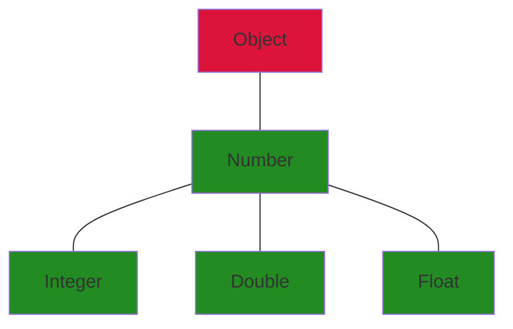
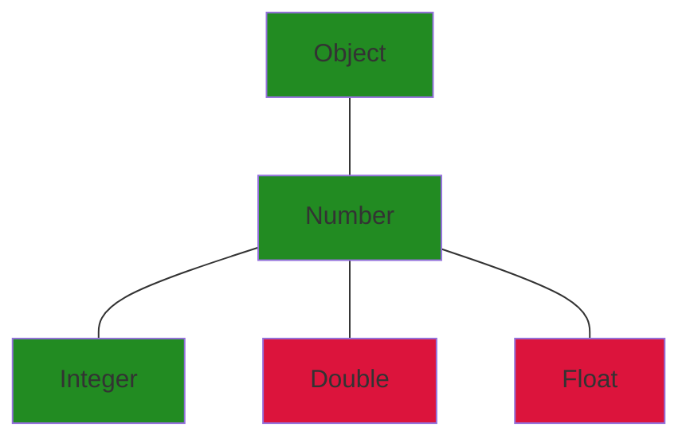

# Wykład 4
### **Typy Generyczne** 
### **Wprowadzenie**
### **Konwencje, metody, typy surowe**
### **Parametry ograniczone**
### **Podtypy, dziedziczenie**
### **Symbole wieloznaczne**
### **Ograniczenia**
--------------------------

## Typy Generyczne

`Typy generyczne` — są odpowiedzią na *szablony z C++*. Typy generyczne w Javie pozwalają programiście na stworzenie kodu, który **może obsługiwać różne typy danych**, jednocześnie utrzymując bezpieczeństwo typów. Dzięki nim można napisać bardziej ogólny i elastyczny kod, który działa dla różnych typów, <span style="color:green">eliminując potrzebę wielokrotnego definiowania tego samego kodu</span> dla różnych typów danych.

Przykładem może być klasa lub metoda, która operuje na różnych typach danych, ale nie jest związana z konkretnym typem. Poniżej prosty przykład:
```java
//Generyczna klasa para (Pair)
public class Pair<T, U> {
    private T first;
    private U second;

    public Pair(T first, U second) {
        this.first = first;
        this.second = second;
    }

    public T getFirst() {
        return first;
    }

    public U getSecond() {
        return second;
    }

    public void setFirst(T first) {
        this.first = first;
    }

    public void setSecond(U second) {
        this.second = second;
    }

    public static void main(String[] args) {
        // Tworzymy parę z różnymi typami
        Pair<String, Integer> pair1 = new Pair<>("Java", 8);
        Pair<Double, String> pair2 = new Pair<>(3.14, "Pi");

        // Wyświetlamy zawartość par
        System.out.println("Pair 1: " + pair1.getFirst() + ", " + pair1.getSecond());
        System.out.println("Pair 2: " + pair2.getFirst() + ", " + pair2.getSecond());
    }
}
```

W tym przykładzie *Pair* to generyczna klasa, która może przechowywać parę różnych typów danych. Dzięki temu, możemy utworzyć *Pair* przechowujący jednocześnie *Stringa* i *Integera*, oraz inny przechowujący *Double* i *Stringa*. To pozwala na wielokrotne użycie tej samej klasy dla różnych typów danych, co zwiększa elastyczność i ponowne użycie kodu.

#### ZALETY:
- kontrola typów na poziomie kompilacji, a nie dopiero w trakcie działania programu
- brak potrzeby rzutowania
- konstruowanie ogólnych algorytmów

```java
public class Box<T> { // T oznacza Typ
    private T t;
    public void set(T t) {
        this.t = t;
    }
    public T get() {
        return t;
    }
}
//ogólnie:
class NazwaKlasy<T1, T2, ..., Tn> {
    ...
}
```

### Konwencje
- `T` — typ,
- `K` — klucz,
- `V` — wartość,
- `E` — element (np. kolekcji),
- `N` — liczba

```java
public interface Pair<K, V> {
    public K getKey();
    public V getValue();
}
```

<span style="color:red">Nie możemy</span> używać w nawiasach<> **typów prymitywnych** jak *int*, *float*. Jest wymagane używanie typów obiektowych, obiektowych odpowiedników typów prymitywnych jak <u>Int</u>, <u>Float</u> tzw. `Wrapperów`.

### Dlaczego typy prymitywne mogą być problematyczne w kontekście klas generycznych?
Otóż, klasy generyczne w niektórych językach programowania (np. Java, C#) wymagają użycia typów referencyjnych (typów obiektowych), a typy prymitywne są wartościami, nie referencjami. Oznacza to, że nie są one zgodne z wymaganiami klasy generycznej, która spodziewa się obiektów, a nie prostych wartości.

### Dlaczego nie wypada tworzyć kolekcji typu *ArrayList&lt;Object&gt;*? Dlaczego jest to złe?
Taki kod **zadziała**, ale **<span style="color:red">nie będzie bezpieczny</span>** pod względem typów.
```java
ArrayList<Object> cats = new ArrayList<>();
cats.add(new Cat());

Cat myCat (Cat)cats.get(0);
```
trzeba użyć rzutowania, aby kompilator wiedział, że MY wiemy, że element listy „cats” jest typu Cat.

```java
ArrayList<Object> cats = new ArrayList<>();
cats.add(new Dog());
Cat myCat (Cat)cats.get(0);
```
Tutaj wystąpi błąd na poziomie działania programu (`ClassCastException`), ponieważ chcemy zrzutować pierwszy element listy *cats* na typ *Cat* a tak naprawdę to typ *Dog*.
Dostajemy błędy bo nie zrzutowaliśmy obiektu, albo źle go zrzutowaliśmy
### Porównanie ArrayList oraz ArrayList&lt;Object&gt;

- **ArrayList<>**: Zapewnia bezpieczeństwo typów, co oznacza, że kompilator Java sprawdzi zgodność typów podczas kompilacji, uniemożliwiając dodawanie niezgodnych typów do listy.

- **ArrayList&lt;Object&gt;**: Zmniejsza bezpieczeństwo typów, ponieważ wszystkie elementy są traktowane jako obiekty klasy *Object*. <span style="color:red">Musisz używać rzutowania typów</span> przy pobieraniu elementów, co może prowadzić do **błędów wykonania**, jeśli rzutowanie nie jest zgodne.

##### Interfejs Generyczny

```java
public class OrderedPair<K, V> implements Pair<K, V> {
    private K key;
    private V value;
    public OrderedPair(K key, V value) {
        this.key = key;
        this.value = value;
    }
    public K getKey() { return key; }
    public V getValue() { return value; }
}
Pair<String, Integer> p = new OrderedPair<String, Integer>("Even", 8);
Pair<String, Integer> p = new OrderedPair<>("Even", 8); // Java 7
```
### Typy surowe

Typ surowy *(raw type)* w języku Java to specjalny rodzaj typu generycznego, który nie posiada informacji o parametrach generycznych.Typ surowy można uzyskać, pomijając parametry generyczne przy deklaracji i użyciu klasy lub interfejsu generycznego
```java
public class Box<T> {
    public void set(T t){ ... }
    ...
}

Box<String> typedBox = new Box<String>();
Box rawBox = new Box(); // typ surowy <=> Box<Object>

Box rawBox = typedBox;
rawBox.set(8); // warning: w trakcie działania programu może spowodować RuntimeException
```
Ze względu na możliwość popełnienia błędów, nie zaleca się
stosowania typów surowych.

### Metody Generyczne

```java
public class Util {
    // Genericzna metoda statyczna
    public static <K, V> boolean compare(Pair<K, V> p1, Pair<K, V> p2) {
        return p1.getKey().equals(p2.getKey()) &&
                p1.getValue().equals(p2.getValue());
    }
}
//wywołanie metody generycznej:
Pair<Integer, String> p1 = new Pair<>(1, "jabłko");
Pair<Integer, String> p2 = new Pair<>(2, "gruszka");
boolean same = Util.<Integer, String>compare(p1, p2);
```
>od javy 7 nie trzeba powtarzać typów <Integer, String> - kompilator się domyśli na podstawie wcześniejszej deklaracji

Możemy mieć klasę, która sama w sobie generyczna nie jest, ale posiada metody generyczne.

### Parametry Ograniczone
Zawężanie typu generycznego do takich typów, które **rozszerzają daną klasę lub interfejs**.
Tak,<u>rozszerzają interfejs</u>, taki jest w tym przypadku syntax.

```java
public class Box<T> {
...
    public <U extends Number> void inspect(U u){
        System.out.println("T: " + t.getClass().getName());
        System.out.println("U: " + u.getClass().getName());
    }
    public static void main(String[] args) {
        Box<Integer> integerBox = new Box<Integer>();
        integerBox.set(new Integer(10));
        integerBox.inspect("some text"); // error: String to nie Number
    }
}
```

#### Wielokrotne ograniczenia

```java
<T extends B1 & B2 & B3>
```

Przykład:
```java
class A { /* ... */ }
interface B { /* ... */ }
interface C { /* ... */ }
class D <T extends A & B & C> { /* ... */ }
```
>typ *T* musi **rozszerzać** klasę <span style="color:green">A</span> i **implementować** interfejsy <span style="color:royalblue">B</span> i <span style="color:brown">C</span>
>
>***UWAGA:*** <span style="color:green">A</span> musi być zadeklarowana jako pierwsza (inaczej błąd w trakcie kompilacji)

```java
public static <T> int countGreaterThan(T[] anArray, T elem) {
    int count = 0;
    for (T e : anArray)
    if (e > elem) // błąd kompilacji. Co oznacza '>'?
        +count;
    return count;
}
```

">" nie jest zdefiniowany dla każdego typu, dlatego ograniczamy nasz typ T do np. `T extends Number` lub `T rozszerza interfejs Comparable<T>`, metoda *compareTo()* porównuje dany element tablicy *„e”* do podanego elementu *„elem”* i jeśli zwróci coś większego od 0 to *„e”* jest większe.


Poprawnie:
```java
public static <T extends Comparable<T>> int countGreaterThan(T[] anArray, T elem) {
    int count = 0;
    for (T e : anArray)
    if (e.compareTo(elem) > 0)
        ++count;
    return count;
}
```

## Podtypy, Dziedziczenie

istnieje klasa lub interfejs o nazwie `Box`, która jest generyczna i parametryzowana typem *Integer*. 
*Box&lt;Number&gt;* i *Box&lt;Integer&gt;* są w hierarchii dziedziczenia od siebie niezależne. Domyślnie rozszerzają klasę *Object*, nic więcej nie wiemy.


```java
Box<Integer> boxInteger;
Box<Number> boxNumber;
Box box;
box = boxInteger; // ok
box = boxNumber; // ok
boxNumber = box; // warning: Unchecked Conversion;
boxInteger = box; // warning: Unchecked Conversion;
boxInteger = boxNumber; // błąd kompilacji
boxNumber = boxInteger; // błąd kompilacji
```
1. Możemy podstawić cokolwiek i kompilator się tym nie przejmuje
2. Typ surowy możemy również podpisać pod dany typ generyczny
3.  Nie możemy przypisywać tych typów do siebie, ponieważ nie ma hierarchii dziedziczenia między klasami *Box&lt;Number&gt;* i *Box&lt;Integer&gt;*

#### Jak działa dziedziczenie w typach generycznych?
```java
interface PayloadList<E,P> extends List<E> {
    void setPayload(int index, P val);
    ...
}
```
Gdy stworzymy sobie `PayloadList<String, String>` nie dziedziczy on po jakimś *PayloadList<>* tylko odrazu po nadtypie *PayloadList* czyli **List&lt;E&gt;**.

Tworząc inne PayloadListy tworzymy jakby kolejne wyspecyfikowane instancje PayloadList<E,P>. W przypadku poniżej `PayloadList<String, String>`,`PayloadList<String, Integer>` oraz
`PayloadList<String, Exception>` ostnieją obok siebie, nie dziedzczą po żadnym *PayloadList<>*.


### SYMBOLE WIELOZNACZNE (*WILDCARDS*)

W kodzie generycznym znak zapytania `?`, zwany symbolem wieloznacznym, reprezentuje nieznany typ. Symbolu wieloznacznego można używać w różnych sytuacjach: jako typ parametru, pola lub zmiennej lokalnej.

```java
public static void printList(List<?> list) {
for (Object elem: list)
System.out.print(elem + " ");
System.out.println();
}
```

**<span style="color:red">UWAGA! </span> Metoda:**

```java
public static void printList(List<Object> list)
```
Celem *printList* jest wydrukowanie listy dowolnego typu, ale nie osiąga tego celu — drukuje tylko listę instancji `Object`; nie może wydrukować **List&lt;Integer&gt;**, **List&lt;String&gt;**, **List&lt;Double&gt;** i tak dalej, ponieważ <u>nie są one podtypami</u> *List&lt;Object&gt;*. Aby napisać ogólną metodę printList, użyj *List<?>* jak w pierwszym przykładzie.

```java
public interface StrictClass<T> {
  public T doFunction(Class<T> clazz);
}

public interface EasyClass {
  public void doFunction(Class<?> clazz);
}
```

#### SYMBOLE WIELOZNACZNE Z GÓRNYM OGRANICZENIEM

Ograniczenie od góry — oznacza, że parametr generyczny musi być typem, który `jest lub rozszerza określony typ`. W przypadku *<? extends Number>* ograniczenie od góry wskazuje, że parametr generyczny może być typem *Number* lub dowolnym typem, który rozszerza klasę *Number*.



W praktyce oznacza to, że do metody można przekazać listę elementów dowolnego typu, który jest podtypem lub samym typem Number. Na przykład, można przekazać listę obiektów Integer, Double, Float itp. Natomiast klasa Object nie przejedzie.

```java
public static double sumOfList(List<? extends Number> list) {
    double s = 0.0;
    for (Number n : list)
        s += n.doubleValue();
    return s;
}
```
**<span style="color:red">UWAGA: deklaracja / definicja metody</span>**
```java
public static double sumOfList(List<T extends Number> list)
```
jest niepoprawną składnią. Taka składnia jest dopuszczalna dla **deklaracji klas** lub **wartości zwracanych** (por. parametry ograniczone).

#### SYMBOLE WIELOZNACZNE Z DOLNYM OGRANICZENIEM

Ananlogicznie w podobny sposób symbol wieloznaczny z dolną granicą ogranicza nieznany typ do określonego typu lub nadtypu tego typu.
Dolny symbol wieloznaczny jest wyrażany za pomocą znaku wieloznacznego `?`, po którym następuje słowo kluczowe `super`, po którym następuje jego dolna granica: `<? super A>`.

>**<span style="color:red">UWAGA:</span>** Można określić górną granicę symbolu wieloznacznego lub dolną granicę, ale nie można określić obu.



Aby napisać metodę działającą na listach *Integer* i nadtypach* Integer*, takich jak *Integer*, *Number* i *Object*, należy określić *List<? super Integer>*. Termin *List&lt;Integer&gt;* jest bardziej restrykcyjny niż *List<? super Integer>*, ponieważ pierwsza pasuje tylko do listy typu *Integer*, podczas gdy druga pasuje do listy dowolnego typu, który jest nadtypem *Integer*.

```java
public static void addNumbers(List<? super Integer> list) {
    for (int i = 1; i <= 10; i++) {
        list.add(i);
    }
}
```

#### Relację pomiędzy Listami różnych typów?


Poniższy diagram przedstawia relacje między kilkoma klasami List zadeklarowanymi przy użyciu symboli wieloznacznych z górną i dolną granicą.


## Słowo kluczowe *super*

W języku Java słowo kluczowe `super` jest używane do odwoływania się do metody lub pola zadeklarowanego w klasie nadrzędnej (superklasie) lub do wywołania konstruktora klasy nadrzędnej.

**1. Wywołanie metody z klasy nadrzędnej:**
Można użyć `super` do wywołania metody z klasy nadrzędnej, gdy w klasie podrzędnej ta sama metoda jest zdefiniowana.

```java
class KlasaNadrzedna {
    void metoda() {
        System.out.println("Metoda z klasy nadrzędnej");
    }
}


class KlasaPodrzedna extends KlasaNadrzedna {
    void metoda() {
        super.metoda(); // Wywołanie metody z klasy nadrzędnej
        System.out.println("Metoda z klasy podrzędnej");
    }
}
```

**2. Wywołanie konstruktora klasy nadrzędnej:**
Słowo kluczowe `super` można również użyć do wywołania konstruktora klasy nadrzędnej z konstruktora klasy podrzędnej.

```java
class KlasaNadrzedna {
    KlasaNadrzedna() {
        System.out.println("Konstruktor klasy nadrzędnej");
    }
}

class KlasaPodrzedna extends KlasaNadrzedna {
    KlasaPodrzedna() {
        super(); // Wywołanie konstruktora klasy nadrzędnej
        System.out.println("Konstruktor klasy podrzędnej");
    }
}
```

W obu przypadkach słowo kluczowe "super" jest używane do uniknięcia konfliktu nazw w przypadku, gdy w klasie podrzędnej istnieje element o tej samej nazwie co w klasie nadrzędnej.

## Przechwytywanie symboli wieloznacznych *(Wildcard capture)*

```java
public class WildcardError {
    void doSomething(List<?> l) {
        l.set(0, l.get(0)); // blad kompilacji
    }
}
```
występuje tu błąd kompilacji, ponieważ nie wiadomo czy to „cokolwiek” z *l.get(0)* pasuje do listy zawierającej cokolwiek, *List&lt;?&gt; l*, <u>bo cokolwiek nie oznacza wszystko</u>. 

Myślenie zastosowane tutaj działa inaczej niż człowiek by je zinterpretował. Po wzięciu obiektu za pomocą *get(0)* kompilator zapomina że on był w tej liście i potem chcąc go wsadzić znowu, nie jest pewien czy on tam będzie pasował. Lista l musiałaby być listą obiektów żeby przyjąć nieokreślony obiekt. A znowu, nie mamy *List&lt;Object&gt;* tylko *List<?>* więc nie wiemy co tam jest, <u>może być cokolwiek</u>.

### Jak zatem obejść błąd kompilatora?
Możesz to naprawić, pisząc prywatną metodę pomocniczą, która przechwytuje symbol wieloznaczny. W takim przypadku możesz obejść problem, tworząc prywatną metodę pomocniczą *fooHelper*, jak pokazano w *WildcardFixed*:


```java
public class WildcardFixed {

    void foo(List<?> i) {
        fooHelper(i);
    }


    // Helper method created so that the wildcard can be captured
    // through type inference.
    private <T> void fooHelper(List<T> l) {
        l.set(0, l.get(0));
    }

}
```
Metoda wykorzystuje mechanizm wnioskowania *(inference)*. Tutaj lista jest procesowana jak lista zawierająca konkretne elementy *(typu T)*.

## Wytyczne dotyczące używania symboli wieloznacznych

Jednym z bardziej zagmatwanych aspektów podczas nauki programowania przy użyciu typów generycznych jest określenie, kiedy używać symbolu wieloznacznego z górną, a kiedy z dolną granicą.

`Zmienna IN` — dostarcza dane do kodu. Wyobraź sobie metodę kopiowania z dwoma argumentami: *copy(src, dest)*. Argument *src* dostarcza dane do skopiowania, więc jest to parametr `IN`.

`Zmienna OUT` — przechowuje dane do wykorzystania w innym miejscu. W przykładzie kopiowania *copy(src, dest)* argument *dest* przyjmuje dane, więc jest to parametr `OUT`.

1. zmienne `IN` – górne ograniczenie **extends**,
2. zmienne `OUT` – dolne ograniczenie **super**,
3. W przypadku, gdy dostęp do zmiennej `IN` można uzyskać metodami zdefiniowanymi w klasie Object — brak ograniczeń
4. zmienne `IN/OUT` – nie używamy symboli wieloznacznych nie używamy symboli wieloznacznych jako wartości zwracanych

**extends** – gdy chcemy móc modyfikować listę typów generycznych
**super** – gdy dane są tylko do odczytu

```java
List<Integer> li = new ArrayList<Integer>(); // (  analogia  )
List<? extends Number> ln = li; // OK           ( Object obj = new String() )
ln.add(new Integer(35)); // Blad kompilacji     ( obj.charAt(7) )
```
*List&lt;Integer&gt;* jest podtypem *List<? extends Number>*. A klasy
nie można traktować tak jak podklasy. Jedyne operacje które
można wykonać na takiej liście to:
- dodanie *null*
- wyczyszczenie *clear()*
- pobranie iteratora i wywołanie *remove()*
- zapisać elementy odczytane z listy z wykorzystaniem `wildcard capture`

**W generowanym bytecodzie nie ma czagoś takiego jak typy generyczne** otrzymujemy zwykłe klasy i interfejsy. Aby to zrealizować kompilator:
- zastępuje typy przez ich ograniczenia a nieograniczone typy przez *Object*

- dodaje niezbędne operacje rzutowania
- tworzy metody pomostowe implementujące polimorfizm
w rozszerzonych typach generycznych


```java
public class MyBox extends Box<String>{
    public void set(String s){
        // jakiś kod
    }
}
```
metoda *set()* w klasie Box przyjmuje argument *Object* <span style="color:grey">(wg. bytecode wykonywanego przez JVM)</span> podczas gdy metoda w klasie potomnej przyjmuje *String*. To powoduje brak polimorfizmu. Dlatego kompilator automatycznie dodaje metodę pomostową (do MyBox):
```java
public void set(Object data) {
    set((String) data);
}
```

## Ograniczenia dotyczące generyków

Aby efektywnie używać typów generycznych w Javie, należy wziąć pod uwagę następujące ograniczenia:
- <u>nie można</u> używać typów prymitywnych (`Box<int>`),
- <u>nie można</u> używać operatora **new** ( `E e = new E();` )
- <u>nie można</u> deklarować typów statycznych (`private static T v;`)
- typów parametryzowanych (`List<Integer>`) <u>nie można</u> rzutować ani używać jako argument w operatorze *instanceof*
- <u>nie można</u> używać tablic typów parametryzowanych (`List<Integer>[] arrayOfLists = new List<Integer>[2]`),
- typ generyczny <u>nie może</u> rozszerzać (bezpośrednio lub pośrednio) `Throwable`
- <u>nie można</u> przeciążać metod, których argumenty sprowadzają się do tego samego typu
```java
public class Example {
    public void print(Set<String> strSet) { } //dwie opcje dla roznych typow
    public void print(Set<Integer> intSet) { }
}
```
