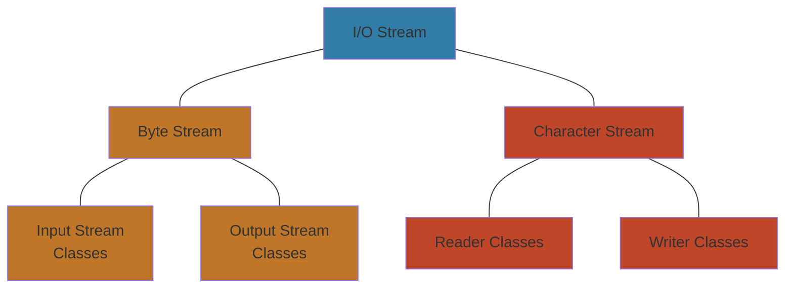

# Wykład 5
## **pakiet *<span>java</span>.io***
## **strumienie bajtowe**
## **strumienie znakowe**
## **strumienie binarne, serializacja i kompresja**
## **narzędzie *jar***

--------------------------

## Pakiet *<span>java</span>.io*

W pakiecie <span>java</span>.io w języku Java `znajdują się klasy i interfejsy związane z operacjami wejścia/wyjścia` (*I/O*, czyli *Input/Output*). Obejmuje to różne klasy do obsługi plików, strumieni danych, operacji wejścia/wyjścia binarnego i tekstowego itp.

Niektóre z głównych klas i interfejsów zawartych w pakiecie <span>java</span>.io:

1. **Klasy bazowe**
    - `InputStream` — Klasa bazowa dla wszystkich strumieni wejściowych
    - `OutputStream ` — Klasa bazowa dla wszystkich strumieni wyjściowych
    - `Reader` — Klasa bazowa dla wszystkich czytników
    - `Writer` — Klasa bazowa dla wszystkich pisarzy
2. **Operacje na plikach**
    - `File` — Reprezentuje ścieżkę do pliku lub katalogu na systemie plików
    - `FileInputStream` — Zapewnia strumień wejściowy z pliku
    - `FileOutputStream` — Zapewnia strumień wyjściowy do pliku
3. **Strumienie znakowe**
    - `FileReader` — Zapewnia czytanie znaków z pliku
    - `FileWriter` — Zapewnia pisanie znaków do pliku
3. **Strumienie bajtowe**
    - `BufferedInputStream` — Zapewnia buforowanie danych wejściowych w celu zwiększenia wydajności
    - `BufferedOutputStream` — Zapewnia buforowanie danych wyjściowych w celu zwiększenia wydajności
    - `ByteArrayInputStream` — Implementuje strumień wejściowy na podstawie tablicy bajtów
    - `ByteArrayOutputStream` — Implementuje strumień wyjściowy na podstawie tablicy bajtów
4. **Operacje wejścia/wyjścia tekstowego**
    - `BufferedReader` — Zapewnia buforowanie danych wejściowych tekstowych
    - `BufferedWriter` — Zapewnia buforowanie danych wyjściowych tekstowych
    - `PrintWriter` — Ułatwia formatowane pisanie do pliku lub strumienia
5. **Serializacja**
    - `ObjectInputStream` — Odczytuje obiekty z danego strumienia wejściowego (używane do deserializacji)
    - `ObjectOutputStream` — Zapisuje obiekty do danego strumienia wyjściowego (używane do serializacji)

## Strumienie



### Strumienie bajtowe
**Strumienie bajtowe to strumienie, które przesyłają informacje w formie pojedynczych bajtów.**
W każdej grupie strumieni mamy dwa typy strumieni:
- `strumienie wejścia`(strumienie z danymi, które przychodzą z zewnątrz do procesora)
- `strumienie wyjścia` (strumienie z danymi, które wychodzą z procesora na zewnątrz)

>**<span style="color:green">Strumienie bajtowe traktują dane jak zbiór ośmiobitowych bajtów</span>**. 
Wszystke strumienie bajtowe rozszerzają klasy *InputStream* <span style="color:grey">(dane przychodzące do programu)</span> lub *OutputStream* <span style="color:grey">(dane wychodzące z programu)</span>

Przykład programu, który kopiuje zawartość jednego pliku do drugiego:
```java
import java.io.FileInputStream;
import java.io.FileOutputStream;
import java.io.IOException;
public class CopyBytes {
    public static void main(String[] args) throws IOException {
        FileInputStream in = null;
        FileOutputStream out = null;
        try {
            in = new FileInputStream("input.txt"); // FileInputStream
            out = new FileOutputStream("output.txt"); // FileOutputStream
            int c;
            while ((c = in.read()) != -1) {
                out.write(c);
            }
        } finally {     // Strumienie zawsze należy zamykać!
            if (in != null) {
                in.close();
            }
            if (out != null) {
                out.close();
            }
        }
    }
}
```
Za pomocą metody *read()* odczytujemy jeden bajt ze zmiennej in i zapisujemy w zmiennej c.
Gdy dojdziemy do końca pliku zwróci nam wartość `-1`.
Za pomocą metody *write()* wysyłamy odczytaną wartość z metody *read()* do pliku *„output.txt”*

warunek `if (in != null)` zabezpiecza nas przed *NullPointerException*, bo owy wyskoczy, gdy na null wykonamy jakąkolwiek funkcję

>Strumienie bajtowe reprezentują ***“niskopoziomowy”*** dostęp do danych. 
Dlatego w konkretnych sytuacjach **<span style="color:cyan">warto je zastąpić przez bardziej specjalistyczne rodzaje strumieni.</span>**


Klasy `InputStream` i `OutputStream` są **klasami abstrakcyjnymi** i wraz z nimi metody *read()* i *write()*, dlatego w zależności z jakim rodzajem strumienia mamy do czynienia, metody *read()* i *write()* <span style="color:green">trzeba nadpisać, aby działały poprawnie.</span>

### Strumienie znakowe

Przeznaczone są do pracy z danymi tekstowymi. Jak w strumieniu bajtowym odczytywaliśmy wartości typu int (to co zwraca funkcja read() jest intem), to w strumieniu znakowym odpowiednikiem będzie typ char.

**Strumień bajtowy** &rarr; `int`
**Strumień znakowy** &rarr; `char`

Strumienie znakowe automatycznie **konwertują dane tekstowe do formatu Unicode** <span style="color:grey">(stosowanego natywnie w Javie)</span> — w porównaniu do języka C gdzie konwersja odbywała się przez tablicę ASCII.
Konwersja jest dokonywana w oparciu o ustawienia regionalne komputera, na którym uruchomiono JVM (Wirtualną Maszynę Javy), lub jest sterowana “ręcznie” przez programistę. 

```java
import java.io.FileInputStream;
import java.io.FileOutputStream;
import java.io.IOException;
public class CopyBytes {
    public static void main(String[] args) throws IOException {
        FileInputStream in = null;
        FileOutputStream out = null;
        try {
            in = new FileReader("input.txt"); // FileReader
            out = new FileWriter("output.txt"); // FileWriter
            int c;
            while ((c = in.read()) != -1) {
                out.write(c);
            }
        } finally {     // Strumienie zawsze należy zamykać!
            if (in != null) {
                in.close();
            }
            if (out != null) {
                out.close();
            }
        }
    }
}
```

>Strumienie znakowe rozszerzają klasy *Reader* (dane przychodzące do programu) lub *Writer* (dane wychodzące z programu)


Strumienie znakowe wykorzystuję do komunikacj strumienie bajtowe, 
a same zajmują się konwersją danych.

## Dodatkowe klasy rozszerzające klasy Writer i Reader oraz InputStream i OutputStream:

### Strumienie Buforowane

Strumienie znakowe buforowane pozwalają na raz odczytać `więcej niż jeden znak`, **linię po linii** z pliku zamiast znak po znaku.

```java
BufferedReader in = null;
PrintWriter out = null;

try {
    in = new BufferedReader(new FileReader("input.txt"));
    out = new PrintWriter(new FileWriter("output.txt"));
    String l;
    while ((l = in.readLine()) != null) {
        out.println(l);
    }
 } catch {...}
```
w konstruktorze musi być podany inny strumień, który robi większość roboty, a strumień opakowujący dodaje tylko dodatkowe funkcjonalności — tutaj: *BufferedReader()* umożliwia buforowanie, odczytywanie linia po linii

**Funkcjonalność klasy *BufferedReader* sprowadza się głównie do metody *readLine()***, która odczytuje całą linię z dokumentu i zapisuje ją do zmiennej `l` typu *String*.
Klasa *PrintWriter* zawiera metodę *println()*, która wyświetla zawartość zmiennej `l` linia po linii.

Istnieją cztery klasy buforowanych strumieni:
- `BufferedInputStream` &rarr; strumień <span style="color:Dodgerblue">bajtowy</span>
- `BufferedOutputStream` &rarr; strumień <span style="color:Dodgerblue">bajtowy</span>
- `BufferedReader` &rarr; strumień <span style="color:orange">znakowy</span>
- `BufferedWriter` &rarr; strumień <span style="color:orange">znakowy</span>

Aby wymusić zapis danych poprzez wyjściowy, buforowany strumień, można użyć metody `flush()`.

**W strumieniach buforowanych, dane, które wysyłamy albo odczytujemy trafiają najpierw do bufora**. Dane odczytujemy z bufora lub są one pobierane z niego i transferowane dopiero do docelowego miejsca.` Aby wymusić taki transfer w konkretnej chwili możemy skorzystać z metody flush()`. Flushowanie pliku to wyrzucanie do niego z buforów dane, które powinni się znaleźć w tym miejscu. 
Jest to użyteczne, gdy chcemy widzieć efekt działania programu na bieżąco, np. po przez używanie progress baru:

    ▰▰▰▰▰▰▱▱▱▱ 60%

### Skanowanie

Scanner jest rodzajem strumienia buforowanego znakowego i różni się od innych strumieni tym, że standardowo **odczytuje z pliku do ustalonego znaku**<span style="color:grey">(Domyślnie — Whitespace, spacja)</span>, czyli np. słowo po słowie. Oficjalnie takie słowa nazywa się `tokenami` i możemy ustalić, czym są rozdzielane <span style="color:grey">(domyślnie przez *Character.isWhitespace(char c)* – zwraca true, gdy napotka znak biały).</span>

```java
import java.io.*;
import java.util.Scanner;
public class ScanXan {
    public static void main(String[] args) throws IOException {
        Scanner s = null;
        try {                       // możemy opuścić BufferedReader()
            s = new Scanner(new BufferedReader(
                                            new FileReader("input.txt")));
            while (s.hasNext()) {
                System.out.println(s.next());
            }
        } finally {
            if (s != null) {
                s.close();
            }
        }
    }
}
```

Obiekt należy zamknąć ze względu na strumień, z którym jest 
związany. 

**Aby zmienić zachowanie obiektu *Scanner***, można skorzystać 
z metody: `useDelimiter()`. Przykładowo s.useDelimiter(",\\s*");
zmienia znak rozdzielający na przecinek po którym następuje dowolna 
liczba “białych spacji”.

`\` — musimmy napisać dwie spacje aby reprezentować jeden jej znak spacji
`\s` — oznacza białą spację
`*` — dowolna ilość znaku poprzedzającego


#### Jak używać Scannera?

Tworzymy go wokół strumienia buforowanego (ale nie koniecznie, nie muszą być tylko buforowane, może być dowolny *InputStream*). 
Klasa Scanner zawiera metodę `hasNext()`, która zwraca **true**, <span style="color:green">jeżeli istnieje następny token</span> (wyraz do odczytania), a **false**, <span style="color:red">gdy nie istnieje</span>, czyli wiemy, że jest wtedy koniec pliku.

Kolejny znak odczytuje się metodą `next()`,

    s.next();
    
s.next() zwraca stringa z tym wyrazem (tokenem).

## Formatowanie

Wyjściowe strumienie znakowe umożliwiają podstawowe formatowanie 
danych za pomocą kilku odmian metody print() i format().

Przykłady zastosowania:
```java
double d = 2.0;
double s = Math.sqrt(2.0);
System.out.println("Pierwiastek z " + d + " to " + s + ".");
```
>Pierwiastek z 2.0 to 1.4142135623730951

Jak wypisać daną liczbę znaków po przecinku?
```java
System.out.format("Pierwiastek z %f to %.4f\n", d, s);
```
>Pierwiastek z 2,000000 to 1,4142

<span style="color:grey">Składnia przy formatowaniu obowiązuje taka jak w C.</span>

`%f` – domyślnie wypisuje się 6 miejsc po przecinku
`%.4f` – wypisze 4 miejsca po przecinku

Funkcja `format()` korzysta z ustawień regionalnych na komputerze, jeżeli mamy zainstalowanego np. Windowsa po polsku, to domyślnie do rozdzielania liczb zamiast kropki `.` używamy przecinka `,`.

Oczywiście można wymusić na funkcji jakiego formatowania ma używać:

```java
System.out.format(Locale.US, "Pierwiastek z %.1f to %.4f\n", d, s);
System.out.printf(Locale.US, "Pierwiastek z %.1f to %.4f\n", d, s);
```
>Pierwiastek z 2.0 to 1.4142

Można używać zamiennie `format()` oraz `printf()`

### Metody Wieloargumentowe

oznaczenie "`…`" mówi JVM, że wywołanie tej metody to nie jest wywołanie od tablicy intów, tylko takie, że inty przychodzą po przecinku i może ich być niewiadomo ile.

Aczkolwiek *ints* <u>traktujemy później jak tablicę.</u>

```java
public static void multiint(int ... ints){
    for (int i=0; i<ints.length; i++)
        System.out.println(ints[i]);

    System.out.println();

    for(int i: ints)
        System.out.println(i);
}

public static void main(String[] args){
    multiint(123,34,65,76,44,11,0);
    multiint();
    multiint(12, 28);
}
```

W metodach wieloargumentowych można używać także pojedynczych zmiennych, ale **zmienna wieloargumentowa zawsze musi być na końcu**, aby było wiadomo, że od początku tego argumentu do końca wszystkie znaki należą do jednego argumentu.

<span style="color:red">Nie można</span> zawrzeć w jednej metodzie wieloargumentowej **<span style="color:red">więcej niż jednej zmiennej wieloargumentowej.</span>**

### Zasoby i lokalizacja
projektanci Javy wprowadzili mechanizm, który umożliwia napisanie jednego programu, który będzie komunikował się w różny sposób, w zależności od tego, gdzie będzie uruchomiony (jeśli będzie używany w Polsce, to komunikaty będzie wypisywał po polsku itp.)

Aby uzyskać taki efekt, używamy klasy `ResourceBundle`. 
ResourceBundle współpracuje z plikami jak dla klasy *Properties* w których są zdefiniowane różne klucze i ich wartości ( klucz = wartość, klucz1 = wartość1, …)

```java
import java.util.Locale;
import java.util.ResourceBundle;
public class LocalizationExample {
    public static void main(String[] args){
        ResourceBundle rb = ResourceBundle.getBundle("resources");
        for(String key: rb.keySet())
            System.out.println(key + ": " + rb.getString(key));
    }
}
```
W powyższym przykładzie zmienna *rb* przechowuje takie klucze i wartości z pliku *„resources”*, które pobiera funkcja *getBundle()*.
Możemy w ten sposób wczytać inne podobne pliki w innych językach, które w zależności od ustawień lokalnych danego komputera, będą pobierać odpowiedni plik z odpowiednimi kluczami i wartościami.

| Klucz | resources_en.properties | resources_pl.properties |
|-------|------------------------|------------------------|
| KeyHello | hello | witaj |
| KeyWorld | world | świat |
| KeyKey | key | klucz |

Statyczna metoda `getBundle("resources")` jest równoważna wywołaniu:
```java
getBundle("resources", Locale.getDefault(), this.getClass().getClassLoader())
```
i za pomocą bieżącego **ClassLoader**a poszukuje pliku o nazwie:

    baseName +"_"+ language +"_"+ script +"_"+ country +"_"+ variant +".properties"

Konkretna nazwa pliku jest ustalana na podstawie ustawień regionalnych systemu operacyjnego (`Locale.getDefault()`), np. **resources_en_US_WINDOWS_VISTA.properties**. Metoda ta wczytuje pary (klucz,wartość). Dzięki temu można łatwo dostosować komunikaty, używane przez program do użytkownika.

>Do słówka *“resources”* czyli baseName z metody *getBundle()*, JVM dodaje sobie dodatkowe znamiona pokroju właśnie *language*, *script*, *country* itp. , a później metoda dalej wyszukuje odpowiedni plik z tymi nazwami, do pobrania.
**Gdy program nie znajdzie pełnej nazwy pliku**, to od prawej strony **zacznie ucinać pojedyncze słowa**. <u>Dlatego plik resources.properties powinien zawierać defaultowe wartości.</u>

```java
class NetworkClassLoader extends ClassLoader {
    String host;
    int port;
    public Class findClass(String name) {
        byte[] b = loadClassData(name);
        return defineClass(name, b, 0, b.length);
    }
    private byte[] loadClassData(String name) {
        // wczytywanie bytecode'u klasy z określonej
        // lokalizacji sieciowej
        . . .
    }
}
```
*Na razie tylko wzmianka:
>Class Loader w Javie to mechanizm z pakietu java.lang, który jest odpowiedzialny za ładowanie klas.


**findClass()** — szuka podanej klasy po jej nazwie.
**loadClassData()** — załadowuje bytecode podanej klasy do tablicy b.
**defineClass()** — definiuje klasę na podstawie podanych informacji
Możemy zmienić działanie ClassLoadera w taki sposób, aby on szukał tej klasy nie tam gdzie standardowo JVM, tylko gdzieś indziej.


### Strumienie Binarne

Strumienie binarne w Javie służą do obsługi danych binarnych, pozwalają efektywniej zarządzać zasobami. Istnieją dwa podstawowe rodzaje strumieni:

- strumienie danych: **DataInputStream** i **DataOutputStream**:
 ```java
 DataOutputStream dos = new DataOutputStream(System.out); // gdy zapisujemy typy
 dos.writeDouble(123.12);                                //prymitywne do strumienia
 dos.writeUTF("Grzegrz\u00f3\u0142ka"); 
 dos.writeInt(12345);
 dos.close();
 ```
- strumienie obiektowe: **ObjectInputStream** i **ObjectOutputStream**:
```java
 ObjectOutputStream oos = new ObjectOutputStream(System.out); //gdy typy obiektowe
 oos.writeObject("Grzegrz\u00f3\u0142ka"); 
 oos.close();
 ```

 Metoda `writeUTF()` i `writeObject()` są dwiema różnymi metodami używanymi do zapisywania danych przy użyciu strumieni wyjściowych w Javie.

`writeUTF()` w klasie DataOutputStream:
- jest częścią klasy DataOutputStream, która implementuje interfejs *DataOutput*.
- Służy do zapisywania ciągów znaków w formie kodowania znaków **Unicode** o zmiennej długości. Jest często używana do zapisywania tekstu w formie binarnej, gdy potrzebne jest reprezentowanie znaków spoza zakresu ASCII.

```java
try (DataOutputStream dataOutputStream = new DataOutputStream(new FileOutputStream("data.bin"))) {
    String text = "Hello, 你好, привет!";
    dataOutputStream.writeUTF(text);
} catch (IOException e) {
    e.printStackTrace();
}

```

`writeObject()` w klasie ObjectOutputStream:
- jest częścią klasy *ObjectOutputStream*, która implementuje interfejs *ObjectOutput*.
- Służy do zapisywania obiektów w formie binarnej, umożliwiając serializację obiektów i zapisywanie ich w postaci, którą można później odczytać i zdeserializować.
- Jest bardziej ogólna, ponieważ może zapisywać dowolne obiekty, **pod warunkiem, że obiekty są serializowalne.**

## Serializacja
Serializacja w języku Java to proces przekształcania stanu obiektu w sekwencję bajtów, którą można zapisać do pliku lub przesłać przez sieć. Można to zrozumieć jako konwersję stanu obiektu do strumienia bajtów, a deserializacja to odwrotny proces.

**<span style="color:red">Aby obiekt mógł być zserializowany,
klasa go reprezentująca musi implementować interfejs Serializable.</span>**

`Serializable` sam w sobie jest pusty, nie posiada metod. daje tylko znać, że te obiekty mogą być zserializowane.

Jeśli chcemy aby obiekty tej klasy wymagały specjalnego traktowania podczas serializacji należy zaimplementować metody:

```java
private void writeObject(java.io.ObjectOutputStream out) throws IOException;
private void readObject(java.io.ObjectInputStream in) throws IOException, ClassNotFoundException;
```

Przykład:

```java
public class SerialisationTest implements Serializable{
    public int id;
    public String name;
    public SerialisationTest(int i, String s){
        this.id = i;
        this.name = s;
    }
    public static void main(String[] args) throws FileNotFoundException,
                                                IOException, ClassNotFoundException{
    
        SerialisationTest st1 = new SerialisationTest(7, "Ala");
        ObjectOutputStream oos = new ObjectOutputStream(
                                new FileOutputStream("output_object"));
        oos.writeObject(st1);
        oos.close();
        SerialisationTest st2;
        ObjectInputStream ois = new ObjectInputStream(
                                new FileInputStream("output_object"));
        st2 = (SerialisationTest)ois.readObject();
        ois.close();
        System.out.println(st2.id + "\t" + st2.name);
    }
}
```
`FileOutputStream` odpowiada za zapis bajtów do pliku *"output_object"*, a `ObjectOutputStream` zajmuje się konwersją obiektów Java na strumień bajtów, który można zapisać do pliku. W rezultacie uzyskujemy mechanizm do zapisywania obiektów do pliku w formie, który może być później odczytany i zrekonstruowany.

## Strumienie Kompresujące

Strumienie kompresujące w Javie to mechanizm, który pozwala na kompresję i dekompresję danych w czasie rzeczywistym podczas operacji wejścia/wyjścia. Java dostarcza kilka klas do obsługi strumieni kompresujących, takich jak `GZIPOutputStream`, `GZIPInputStream`, `ZipOutputStream` i `ZipInputStream`.

Przykład obłsugi Formatu GZIP:
```java
Scanner sc = new Scanner(System.in);
GZIPOutputStream gos = new GZIPOutputStream(
                        new FileOutputStream(args[0]));
while(sc.hasNext()){
    String s = sc.nextLine() + "\n";
    gos.write(s.getBytes());
}
sc.close();
gos.close();
```

GZIPOutputStream **<span style="color:red">nie zapisuje danych do pliku tylko je przetwarza (kompresuje)</span>**. Do zapisu wykorzystuje on strumień, którego instancje dostaje w konstruktorze (tutaj `FileOutputStream`). Analogicznie GZIPInputStream.

>GZIP służy do kompresji9 jedngo pliku a ZIP do kompresji wielu plików.

Przykład obłsugi Formatu ZIP:

```java
ZipOutputStream zos = new ZipOutputStream(
                        new FileOutputStream("plik.zip"));
for(int i=0; i<5; i++){
    ZipEntry ze = new ZipEntry("plik" + i); // rozdziela pojedyncze 
    zos.putNextEntry(ze);
    for(int j=0; j< 1000; j++){
        zos.write("Ala ma kota".getBytes());
    }
    zos.closeEntry();
}
zos.close();

```
Otrzymamy w powyższym przypadku pięć plików i w każdym z nich 1000 razy wypisze się „Ala ma kota”.

## Archiwa JAR

Archiwa Jar mają format identyczny jak pliki zip. Dlaczego więc projektanci javy postanowili zrobić własne archiwum zamiast korzystać z formatu zip?

- do archiwów Jar zostały dodane inne informacje jeszcze, które umożliwiają cyfrowe podpisywanie tych archiwów, mówią od jakiej klasy zacząć uruchamianie pliku itp.
- zip to zewnętrzny format, więc java nie ma kontroli nad tym co z tak skompresowanym plikiem się stanie. Stworzono więc archiwum Jar używając podobnego algorytmu, aby mieć pełną kontrolę nad tym co się tam dzieje.

JAR  &rarr; `JarOutputStream`, `JarInputStream`. 

Archiwa JAR zawierają pliki klas wraz z dodatkowymi zasobami potrzebnymi do działania aplikacji. 
Podstawowe zalety dystrybucji programów w postaci plików jar to:
- **bezpieczeństwo**  — archiwa mogą być cyfrowo podpisywane
- **kompresja**  — skrócenie czasu ładowania apletu lub aplikacji
- **zarządzanie zawartością archiwów** z poziomu języka Java
- **zarządzanie wersjami** na poziomie pakietów oraz archiwów<span style="color:grey">(Package Sealing, Package Versioning)</span>
- **przenośność**

#### Jak stworzyć archiwum Jar?
Archiwum jar tworzy sie używając komendy jar, np:

    jar cf archiwum.jar klasa1.class klasa2.class ...

Użyte opcje:
**<span style="color:orangered">c</span>**  – tworzenie pliku (create),
**<span style="color:darkorchid">f</span>** – zawartość archiwum zostanie zapisana do pliku archiwum.jar 
zamiast do standardowego wyjscia (stdout);
Inne najczęściej używane opcje:
**<span style="color:royalblue">m</span>** – do archiwum zostanie dołączony plik manifest z określonej 
lokalizacji, np:
    
    jar cmf plik_manifest archiwum.jar *

**<span style="color:seagreen">C</span>** – zmiana katologu w trakcie działania archiwizatora, np: 

    jar cf ImageAudio.jar -C images * -C audio *

#### Manifest

W archiwum jar znajduje się katalog META-INF a w nim plik MANIFEST.MF
zawierający dodatkowe informacje o archiwum. Przykładowa 
zawartość:

>Manifest-Version: 1.0
Created-By: 1.5.0-b64 (Sun Microsystems Inc.)
Ant-Version: Apache Ant 1.6.5
Main-Class: pl.edu.uj.if.wyklady.java.Wyklad06

mówi, że po uruchomieniu archiwum wykonana zostanie metoda *main(String[] args)* zawarta w klasie *Wyklad06* znajdującej się w pakiecie `pl.edu.uj.if.wyklady.java.`

Uruchomienie pliku jar:

    java -jar archiwum.jar

**Main-Class** — atrybut
**pl.edu.uj.if.wyklady.java.Wyklad06**  — klasa od której ma się zacząć wykonywanie programu
